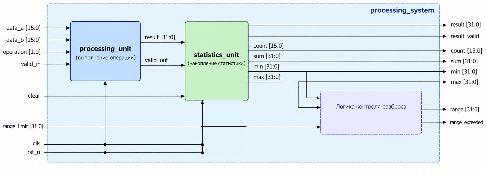
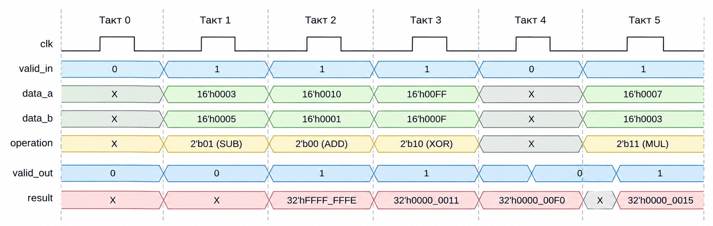

# Лабораторная работа №1

## RTL-разработка и функциональная верификация

### Цель работы

Цель лабораторной работы — разработать RTL-описание цифрового устройства на языке SystemVerilog и проверить его функциональную корректность с помощью моделирования.

Разработанный в данной лабораторной работе проект будет использоваться в последующих лабораторных работах и последовательно пройдёт основные этапы маршрута проектирования цифровой интегральной схемы.

---

# Задание

Необходимо разработать цифровую систему обработки данных `processing_system`, включающую два функциональных блока:

* `processing_unit` — блок арифметической и логической обработки данных;
* `statistics_unit` — блок накопления статистики по результатам вычислений.

Каждый функциональный блок необходимо разработать и проверить отдельно. После проверки отдельных блоков они должны быть объединены в модуле верхнего уровня `processing_system` и проверены совместно.

Модуль верхнего уровня `processing_system` должен не только объединять разработанные блоки, но и выполнять дополнительную обработку накопленной статистики. На основе минимального и максимального значений система должна определять разброс полученных результатов и сравнивать его с заданным порогом.

Общая структура проектируемой системы представлена на рисунке ниже.



Блок `processing_unit` принимает входные операнды и код выполняемой операции. Полученный результат передаётся в `statistics_unit`, который накапливает статистическую информацию по последовательности результатов. Накопленные статистические данные используются модулем верхнего уровня для формирования выходных признаков системы.

Все данные в рамках задания рассматриваются как беззнаковые целые числа, если явно не указано обратное.

---


---

## Блок `processing_unit`

### Назначение

Блок `processing_unit` предназначен для выполнения арифметических и логических операций над двумя 16-разрядными беззнаковыми операндами.

### Интерфейс

Интерфейс блока должен соответствовать следующему описанию:

```systemverilog
module processing_unit (
    input  logic        clk,
    input  logic        rst_n,

    input  logic        valid_in,
    input  logic [15:0] data_a,
    input  logic [15:0] data_b,
    input  logic [1:0]  operation,

    output logic        valid_out,
    output logic [31:0] result
);
```

| Сигнал      | Направление | Разрядность | Назначение                                |
| ----------- | :---------: | ----------: | ----------------------------------------- |
| `clk`       |    input    |           1 | Тактовый сигнал                           |
| `rst_n`     |    input    |           1 | Сигнал сброса, активный уровень — `0`     |
| `valid_in`  |    input    |           1 | Признак наличия корректных входных данных |
| `data_a`    |    input    |          16 | Первый операнд                            |
| `data_b`    |    input    |          16 | Второй операнд                            |
| `operation` |    input    |           2 | Код выполняемой операции                  |
| `valid_out` |    output   |           1 | Признак наличия корректного результата    |
| `result`    |    output   |          32 | Результат выполнения операции             |

### Поддерживаемые операции

| `operation` | Операция                          |
| :---------: | --------------------------------- |
|   `2'b00`   | Сложение                          |
|   `2'b01`   | Вычитание                         |
|   `2'b10`   | Побитовое исключающее ИЛИ (`XOR`) |
|   `2'b11`   | Умножение                         |

### Функциональное поведение

Входные данные принимаются блоком по положительному фронту сигнала `clk`, если `valid_in = 1`.

Блок должен поддерживать приём новой операции на каждом такте. Таким образом, несколько операций могут поступать на вход блока в последовательных тактах без пауз между ними.

Сигнал `valid_out` указывает на корректность значения на выходе `result` и соответствует сигналу `valid_in` с задержкой на один такт. Если в такте **N** `valid_in = 1`, то в такте **N + 1** блок должен установить `valid_out = 1`, а на выходе `result` должен находиться результат операции, принятой в такте **N**. Если в такте **N** `valid_in = 0`, то в такте **N + 1** значение `valid_out` должно быть равно `0`.

При `valid_in = 0` входные значения `data_a`, `data_b` и `operation` не рассматриваются как новая операция.

Значение сигнала `result` является значимым только при `valid_out = 1`. При `valid_out = 0` значение `result` не регламентируется.

Сигнал `rst_n` является синхронным сигналом сброса с активным уровнем `0`. При `rst_n = 0` по положительному фронту `clk` сигнал `valid_out` должен быть сброшен в `0`. После снятия сброса блок начинает принимать входные операции в соответствии с сигналом `valid_in`.

Пример временной диаграммы работы блока `processing_unit` представлен на рисунке ниже.



### Правила выполнения операций

Операнды `data_a` и `data_b` рассматриваются как 16-разрядные беззнаковые числа.

Для операций сложения, вычитания и `XOR` операнды перед выполнением операции расширяются нулями до 32 бит. Результат операции имеет разрядность 32 бита.

Для операции умножения формируется полный 32-разрядный результат произведения двух 16-разрядных операндов.

Вычитание выполняется по правилам беззнаковой 32-разрядной арифметики. Если `data_a < data_b`, результат представляется по модулю $2^{32}$.

Например:

```text id="sub-example"
data_a    = 16'd3
data_b    = 16'd5
operation = 2'b01

result    = 32'hFFFF_FFFE
```


---

## Блок `statistics_unit`

### Назначение

Блок `statistics_unit` предназначен для накопления статистической информации по последовательности входных 32-разрядных беззнаковых значений.

Для принятых входных значений блок должен определять их количество, сумму, минимальное и максимальное значения.

### Интерфейс

Интерфейс блока должен соответствовать следующему описанию:

```systemverilog id="statistics-unit-interface"
module statistics_unit (
    input  logic        clk,
    input  logic        rst_n,

    input  logic        clear,
    input  logic        valid_in,
    input  logic [31:0] data_in,

    output logic [15:0] count,
    output logic [31:0] sum,
    output logic [31:0] min,
    output logic [31:0] max
);
```

| Сигнал     | Направление | Разрядность | Назначение                                    |
| ---------- | :---------: | ----------: | --------------------------------------------- |
| `clk`      |    input    |           1 | Тактовый сигнал                               |
| `rst_n`    |    input    |           1 | Сигнал сброса, активный уровень — `0`         |
| `clear`    |    input    |           1 | Сброс накопленной статистики                  |
| `valid_in` |    input    |           1 | Признак наличия корректного входного значения |
| `data_in`  |    input    |          32 | Входное значение                              |
| `count`    |    output   |          16 | Количество принятых значений                  |
| `sum`      |    output   |          32 | Сумма принятых значений                       |
| `min`      |    output   |          32 | Минимальное из принятых значений              |
| `max`      |    output   |          32 | Максимальное из принятых значений             |

### Функциональное поведение

Входное значение `data_in` принимается блоком по положительному фронту сигнала `clk`, если `valid_in = 1`.

При приёме нового значения статистические данные должны быть обновлены следующим образом:

* `count` увеличивается на `1`;
* `sum` увеличивается на значение `data_in`;
* `min` обновляется, если принятое значение меньше текущего минимального значения;
* `max` обновляется, если принятое значение больше текущего максимального значения.

Первое значение, принятое после сброса или очистки статистики, должно одновременно устанавливать `min` и `max`. До приёма первого значения после сброса или очистки значения `min` и `max` не являются значимыми.

При `valid_in = 0` значение `data_in` не учитывается, а накопленная статистика не изменяется.

Сигнал `clear` предназначен для очистки накопленной статистики. При `clear = 1` по положительному фронту `clk` значения `count` и `sum` должны быть сброшены в `0`. Следующее принятое значение считается первым значением новой последовательности.

Сигнал `clear` имеет приоритет над `valid_in`. Если `clear = 1` и `valid_in = 1` одновременно, накопленная статистика очищается, а значение `data_in` на данном такте не учитывается.

Сигнал `rst_n` является синхронным сигналом сброса с активным уровнем `0`. При `rst_n = 0` по положительному фронту `clk` накопленная статистика должна быть сброшена. После снятия сброса следующее принятое значение считается первым значением новой последовательности.

При переполнении count или sum соответствующий выход должен принимать максимально возможное для своей разрядности значение: 16'hFFFF для count и 32'hFFFF_FFFF для sum. После достижения максимального значения соответствующий выход должен сохранять это значение до очистки статистики сигналом clear или сброса сигналом rst_n.


---

## Модуль верхнего уровня `processing_system`

### Назначение

Модуль `processing_system` предназначен для объединения блоков `processing_unit` и `statistics_unit` в единую систему обработки данных.

Результаты вычислений блока `processing_unit` передаются в `statistics_unit` для накопления статистики. На основе накопленных минимального и максимального значений модуль верхнего уровня дополнительно определяет разброс результатов и формирует признак превышения заданного порогового значения.

### Интерфейс

Интерфейс модуля должен соответствовать следующему описанию:

```systemverilog id="processing-system-interface"
module processing_system (
    input  logic        clk,
    input  logic        rst_n,

    input  logic        valid_in,
    input  logic [15:0] data_a,
    input  logic [15:0] data_b,
    input  logic [1:0]  operation,

    input  logic        clear,
    input  logic [31:0] range_limit,

    output logic        result_valid,
    output logic [31:0] result,

    output logic [15:0] count,
    output logic [31:0] sum,
    output logic [31:0] min,
    output logic [31:0] max,

    output logic [31:0] range,
    output logic        range_exceeded
);
```

| Сигнал           | Направление | Разрядность | Назначение                                   |
| ---------------- | :---------: | ----------: | -------------------------------------------- |
| `clk`            |    input    |           1 | Тактовый сигнал                              |
| `rst_n`          |    input    |           1 | Сигнал сброса, активный уровень — `0`        |
| `valid_in`       |    input    |           1 | Признак наличия корректной входной операции  |
| `data_a`         |    input    |          16 | Первый операнд                               |
| `data_b`         |    input    |          16 | Второй операнд                               |
| `operation`      |    input    |           2 | Код выполняемой операции                     |
| `clear`          |    input    |           1 | Очистка накопленной статистики               |
| `range_limit`    |    input    |          32 | Пороговое значение допустимого разброса      |
| `result_valid`   |    output   |           1 | Признак наличия корректного результата       |
| `result`         |    output   |          32 | Результат выполнения операции                |
| `count`          |    output   |          16 | Количество результатов, учтённых статистикой |
| `sum`            |    output   |          32 | Сумма результатов                            |
| `min`            |    output   |          32 | Минимальный результат                        |
| `max`            |    output   |          32 | Максимальный результат                       |
| `range`          |    output   |          32 | Разброс накопленных результатов              |
| `range_exceeded` |    output   |           1 | Признак превышения допустимого разброса      |

### Функциональное поведение

Модуль `processing_system` должен содержать по одному экземпляру блоков `processing_unit` и `statistics_unit`.

Выход `result` блока `processing_unit` должен быть подключён ко входу `data_in` блока `statistics_unit`, а сигнал `valid_out` — ко входу `valid_in`. Таким образом, в статистике учитываются только корректные результаты вычислений.

Сигналы `result` и `result_valid` модуля верхнего уровня должны соответствовать выходным сигналам `result` и `valid_out` блока `processing_unit`. Значения `count`, `sum`, `min` и `max` должны соответствовать выходам блока `statistics_unit`.

На основе накопленной статистики модуль должен формировать значение `range`, равное разности максимального и минимального значений:

`range = max - min`

Если статистика содержит хотя бы одно принятое значение, сигнал `range_exceeded` должен принимать значение `1`, когда `range` превышает заданное значение `range_limit`. В остальных случаях `range_exceeded` должен быть равен `0`.

До приёма первого значения после сброса или очистки статистики выход `range` должен быть равен `0`, а `range_exceeded` — `0`.

Структурная схема модуля `processing_system` представлена на рисунке ниже.


---

## Требования к функциональной верификации

Для проверки разработанных модулей необходимо создать три отдельных тестовых окружения:

* `processing_unit_tb` — для проверки блока `processing_unit`;
* `statistics_unit_tb` — для проверки блока `statistics_unit`;
* `processing_system_tb` — для проверки системы в целом.

Каждый testbench должен формировать входные воздействия, определять ожидаемый результат и автоматически сравнивать его с фактическими выходными значениями проверяемого модуля.

### Проверка `processing_unit`

Testbench `processing_unit_tb` должен проверять:

* все поддерживаемые операции: сложение, вычитание, `XOR` и умножение;
* корректность результата для различных входных значений, включая граничные значения;
* соответствие `valid_out` сигналу `valid_in` с задержкой на один такт;
* работу при поступлении операций в последовательных тактах без пауз;
* поведение при `valid_in = 0`;
* работу синхронного сброса `rst_n`;
* особенности беззнаковой арифметики, в том числе результат вычитания при `data_a < data_b`.

### Проверка `statistics_unit`

Testbench `statistics_unit_tb` должен проверять:

* корректное изменение `count` и `sum` при поступлении входных значений;
* корректное определение `min` и `max`;
* обработку первого значения после сброса или очистки статистики;
* отсутствие изменения статистики при `valid_in = 0`;
* работу сигнала `clear`;
* приоритет `clear` над `valid_in`;
* работу синхронного сброса `rst_n`;
* насыщение `count` и `sum` при переполнении и сохранение максимального значения до сброса или очистки.

### Проверка `processing_system`

Testbench `processing_system_tb` должен проверять работу системы в целом. В частности, необходимо убедиться, что:

* входные операции корректно обрабатываются блоком `processing_unit`;
* только корректные результаты вычислений учитываются блоком `statistics_unit`;
* `count`, `sum`, `min` и `max` соответствуют последовательности полученных результатов;
* `range` корректно определяется на основе накопленной статистики;
* `range_exceeded` корректно формируется при различных значениях `range_limit`;
* после сброса или очистки, до появления первого результата, `range` и `range_exceeded` имеют требуемые значения;
* система корректно работает при поступлении нескольких операций в последовательных тактах.

### Требования к testbench

Проверка не должна сводиться только к визуальному анализу временных диаграмм. При обнаружении несоответствия ожидаемому поведению testbench должен явно сообщать об ошибке.

После выполнения всех тестов testbench должен выводить сообщение об успешном завершении проверки при отсутствии обнаруженных ошибок.

Временные диаграммы необходимо сохранять и использовать для анализа поведения сигналов, отладки и демонстрации работы устройства при защите лабораторной работы.

## Организация работы

Лабораторная работа выполняется командами по два человека. Допускается индивидуальное выполнение работы.

При работе в команде функциональные блоки распределяются между участниками:

* один студент разрабатывает RTL-описание и testbench для `processing_unit`;
* второй студент разрабатывает RTL-описание и testbench для `statistics_unit`.

После проверки отдельных блоков участники совместно выполняют интеграцию системы: разрабатывают модуль верхнего уровня `processing_system` и testbench `processing_system_tb`.

Каждый студент должен понимать интерфейсы обоих функциональных блоков, их взаимодействие в составе `processing_system` и общую работу системы. При этом на защите студент должен уметь подробно объяснить RTL-описание и верификацию блока, за разработку которого он отвечал.

## Порядок выполнения работы

1. Ознакомиться с заданием и интерфейсами разрабатываемых модулей.

2. При выполнении работы в команде распределить блоки `processing_unit` и `statistics_unit` между участниками.

3. Разработать RTL-описание своего функционального блока в соответствии с заданным интерфейсом и требованиями к его поведению.

4. Разработать testbench для функциональной проверки блока. Провести моделирование и убедиться в корректности его работы.

5. Объединить разработанные блоки в модуле верхнего уровня `processing_system` и реализовать предусмотренную заданием логику верхнего уровня.

6. Разработать `processing_system_tb` и проверить совместную работу блоков в составе системы.

7. Исправить обнаруженные ошибки и повторить моделирование до успешного прохождения всех предусмотренных проверок.

8. Подготовить проект и результаты моделирования к защите лабораторной работы.

## Защита лабораторной работы

Для защиты лабораторной работы студент может выбрать один из двух форматов:

1. защита с предварительно подготовленным отчётом;
2. полная очная защита без отчёта.

Независимо от выбранного формата требования к выполненной работе и уровню понимания разработанного проекта остаются одинаковыми.

### Защита с отчётом

При выборе данного формата студент заранее подготавливает краткий технический отчёт, в котором должны быть представлены:

* описание разработанной системы и её структуры;
* описание реализации функциональных блоков и модуля верхнего уровня;
* описание проведённых проверок;
* результаты функционального моделирования;
* временные диаграммы, подтверждающие корректность работы устройства;
* краткие выводы по результатам работы;

Полные RTL-описаний и testbench включать в отчёт не требуется. Исходный код проекта должен быть доступен преподавателю отдельно.

При наличии отчёта подробная демонстрация всех этапов работы во время защиты не требуется, если соответствующие результаты представлены в отчёте и не вызывают дополнительных вопросов.

### Очная защита без отчёта

При выборе данного формата студент должен непосредственно на защите продемонстрировать выполненную работу и результаты функциональной верификации.

В ходе демонстрации необходимо показать и объяснить те же результаты, которые требуются для отчёта: структуру разработанной системы, особенности реализации, проведённые проверки, результаты моделирования и временные диаграммы.

### Устная часть защиты

Независимо от выбранного формата защита завершается кратким обсуждением работы с преподавателем.

Студент должен понимать назначение и работу разработанной системы, уметь объяснить RTL-описание и testbench своего функционального блока, работу модуля `processing_system`, а также интерпретировать результаты функционального моделирования.

При командном выполнении каждый студент должен подробно понимать разработанный им функциональный блок и соответствующий testbench, а также понимать назначение, интерфейс и основное поведение блока второго участника.

## Методические материалы

Описание основных принципов RTL-разработки на SystemVerilog, рекомендации по построению testbench, запуску функционального моделирования и анализу временных диаграмм приведены в методических материалах к лабораторной работе. 